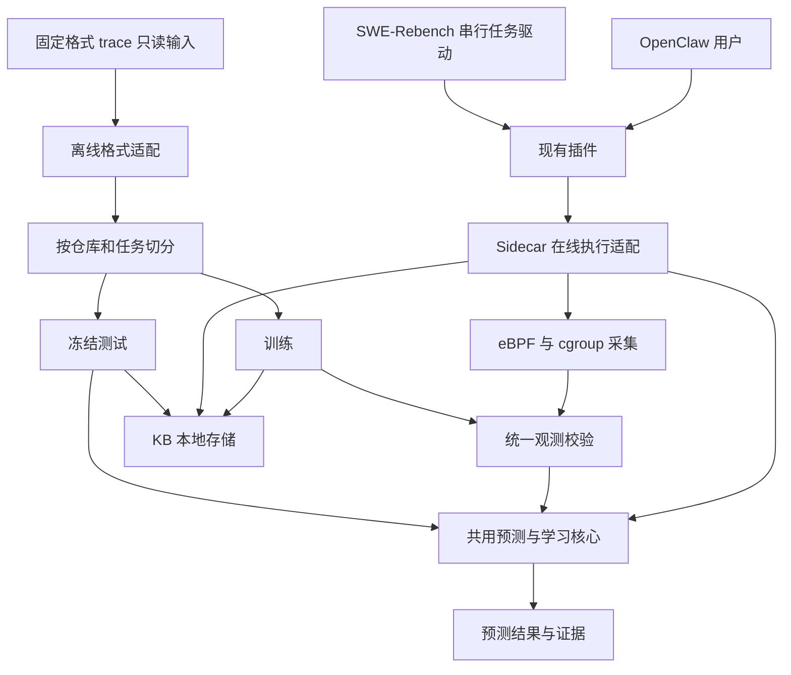

# ClawTune 三路径 Demo 系统设计

日期：2026-09-10。状态：历史设计，已被 2026-09-11 的[多数据集三路径实现设计](MULTI_BENCHMARK_IMPLEMENTATION.md)取代。

当前实现保留五个并列 adapter：swe-rebench、deep-research-bench、swe-bench-verified、bfcl、terminal-bench。本文旧有的 SWE 专用入口、移除 DRB 和未实现状态描述仅用于保留设计背景，不再作为当前范围或操作指南。实际入口、KB 目录、模块边界和验证结果以新版设计及 README 为准。

## 1. 目标与范围

Demo 需要证明两件事：固定离线数据上的预测效果，以及真实使用中预测、采集、学习、持久化的完整闭环。保留三个用户路径，复用同一预测核心和知识库管理代码。

| 路径 | 证明什么 | 知识库行为 | 生命周期 |
| --- | --- | --- | --- |
| OpenClaw 日常使用 | 用户正常使用即可获得预测并积累知识 | 长期可写，跨会话、重启恢复 | 属于本机用户 |
| SWE-Rebench 用户模拟 | 与日常使用相同的学习闭环可以批量运行、检查 | 每个模拟运行独立可写，任务间共享 | 属于一次 run，可显式续跑 |
| 固定 trace 离线实验 | 算法在仓库内任务留出集上的泛化效果 | 只用 train 建库，test 全程冻结 | 属于一次 experiment |

SWE-Rebench 不再默认承担严格 held-out 评估，不要求读取离线测试分区。模拟运行的任务顺序会影响学习，这是实验语义的一部分。严格 80/20 指标由离线路径提供，两类结果分开命名和解释。

第一版保留：一个本机用户、一个日常 Gateway、SWE 串行运行、host-openclaw、Docker 工具沙箱、现有 Linux/eBPF/cgroup 支持。CPU/内存/耗时预测和完成后学习是主线。资源放置建议保持 advisory；不新增自动调度闭环、服务集群、远程 KB、数据库、算法插件市场。

## 2. 当前代码存在的边界问题

- `scripts/clawtune.py benchmark` 透传给 `swe_rebench.runner`；`filter_tasks()` 只做仓库/ID、skip、前 N 个过滤，未接入离线 split。
- 当前 `swe_rebench/config.yaml` 为 `kb_frozen: true`，与本设计的“用户模拟默认学习”不同，需要连同文档和报告语义一起调整。
- 日常 sidecar 默认可写，KB 默认位置是 `trace_dir / tool-resource`；示例 trace_dir 为 `traces`。runner 又从仓库 `traces/tool-resource` 复制 seed。相同目录承担可变用户状态与冷启动来源，会破坏可复现性。
- `cold_start` 的固定 JSONL loader、`scripts/export_resource_lattice.py` 的嵌套 artifact loader、`legacy_eval` 各自组织切分或训练，不能只靠相同 seed 数字推断划分相同。
- `cold_start/__init__.py` 仍依赖 `legacy_eval._bootstrap`，删除旧评估器前必须先移除这个依赖。
- 现有冻结加载器在 `seed-manifest.json` 存在时会校验 KB 哈希，但该清单可缺省；runner 复制清单也只在文件存在时执行。现有校验不能保证任何启动来源都是完整、同一次训练导出的 bundle。
- 当前离线 lattice 导出器生成 lattice 和 clause KB，runtime KB 不由该次导出统一生成。三个文件可被分别更新，缺少统一训练来源约束。
- `benchmark --help` 目前仅展示 wrapper 自身的 `-h`，隐藏实际 runner 参数。

这些问题优先通过入口与存储边界解决，不重写预测算法。

## 3. 模块与依赖



不增加独立服务。模块落点如下：

| 模块 | 职责 | 落点与复用 |
| --- | --- | --- |
| 用户接入 | OpenClaw hooks、调用关联、sidecar 启停 | 保留 `packages/clawtune-plugin` |
| 在线适配 | before 预测、执行采集、after 学习、错误与状态报告 | 保留 `clawtune_sidecar` |
| 预测核心 | 命令解析、管道规则、特征、模型查询、观测更新、调用级组合 | 复用 `tool_resource`、`tool_time` 和 `predictors/call_load.py`；只抽取确需共用的纯逻辑 |
| KB 存储 | seed 校验、首次复制、加载、单写锁、保存、状态检查 | 在现有 Python 源包下增加一个小型 `clawtune_kb` 包；不依赖 FastAPI、Docker、OpenClaw |
| 离线实验 | 固定输入适配、唯一切分、train、test、指标 | 以 `cold_start` 为基础收敛成一个 `offline` 包，吸收现有可用指标代码 |
| 用户模拟 | 任务准备、串行调度、task trace、run 报告 | 简化 `swe_rebench`，学习逻辑完全交给 sidecar |

只共用必要的核心函数：`predict(query)`、`observe(completed_observation)`、`flush()`，以及 seed/state 加载与保存。在线适配层不成为离线评估的启动依赖；离线程序不能因为调用预测而启动采集器或连接模型服务。

输入与输出协议继续由 `contracts/` 下 JSON Schema 定义。新建 seed/state/experiment 清单 schema；Python、TypeScript 和帮助文档跟随 schema。不要在脚本里各定义一份公共字段。

## 4. 知识库的所有权与目录

仅保留两种存储语义：不可变 seed 与可变工作 KB。三条路径是不同所有者，不是三套存储引擎。

```text
<checkout>/seeds/demo-v1/                 # 随 demo 提供，逻辑只读
  manifest.json                         # schema、train 来源、三个 KB 的哈希
  clause-resource-kb.json
  runtime-tool-resource-kb.json
  clause-lattice-time-kb.json

<user-state>/clawtune/                   # 日常用户私有，跨仓库 checkout 存活
  kb/                                   # 长期工作 KB
  traces/

<checkout>/.runtime/swe/<run-id>/         # 每次模拟运行单独拥有
  run.json                              # 任务顺序、seed、环境、进度
  kb/                                   # 整个 run 共享的工作 KB
  traces/<task-id>/<attempt-id>/
  report.json

<checkout>/.runtime/offline/<experiment-id>/
  experiment.json
  split.json                            # 唯一 train/test 清单
  seed/                                 # 本次只用 train 构建，测试阶段只读
  predictions.jsonl
  report.json
  report.md
```

`<user-state>` 默认使用 Linux 用户 state 目录，可由一个 `CLAWTUNE_STATE_DIR` 覆盖；launcher 在提权前解析原始用户的绝对路径，不能因 sudo 写入 `/root` 或污染源码目录。现有安装目录配置与运行状态配置必须区分。

### Seed

- `manifest.json` 记录 schema/特征规则/算法配置版本、训练任务 ID、来源哈希、split 哈希、每个 KB 哈希、有效观测计数、资源单位与采集口径、已知环境信息。
- 同一套训练输入生成三个文件；某个层级无合格标签时输出合法空 KB 和原因，不混入另一批历史数据填补。
- seed 发布后不可覆盖。重新训练产生新版本；本设计不需要远程 registry 或“自动取最新版本”。
- 安装时只为不存在的用户 KB 复制 seed。升级代码不会重新复制并覆盖已有用户知识。
- 学到的数据不自动回流 seed、其他 run 或离线实验。切换 seed 时创建新状态或显式重新初始化，不能把两个来源隐式叠加。

### 工作 KB

- 工作 KB 只在首次创建时复制 seed，之后直接加载自身保存的状态；记录 `base_seed_id/hash` 与递增 generation。
- 同一 run 的所有仓库共享一份 KB，仓库作为现有模型的 repo 特征/命名空间；全局回退仍可复用通用命令知识。不要每仓库创建 sidecar 或复制三个文件。
- 一个可写 KB 同时只有一个 sidecar 写入，通过进程级文件锁强制。日常进程与模拟进程使用不同 KB 和 endpoint。
- sidecar 重用不仅检查端口健康，还核对 owner/state ID；相同端口上属于另一 run 的进程不能被误用。该身份扩展先更新 health schema。
- raw telemetry 与 KB 快照分目录。重启只读取已提交 KB，不自动扫描整个 traces 目录重新训练。
- 保存三个 KB 到一个新 generation，写入哈希清单后原子替换 `CURRENT` 指针；保留上一完整 generation 供恢复，清理更老快照。避免三个文件分别替换产生混代读取；无需数据库事务服务。
- 复用现有单写入协调器，完成事件去重使用稳定 execution ID 和 clause ID。保存点同时覆盖模型和去重状态。首版异常重启恢复到最后完整保存点，报告未提交尾部可能丢失，不承诺任意断电下零损失，也不引入全量日志回放系统。

## 5. 三条路径的完整行为

### A. OpenClaw 日常使用

安装仍使用 `python3 scripts/clawtune.py setup`，日常入口保持 OpenClaw 的 Gateway/TUI。用户不需要在每次会话前手动 train 或指定 KB。

1. plugin 启动/连接属于该用户的 sidecar；首次使用从明确的默认 seed 初始化，之后恢复用户 KB。
2. before hook 用执行前可获得的 query 信息预测，记录预测所用 generation。
3. 命令真实执行；完成采集和标签校验后加入在线观测。
4. writer 批量准备可查询的新状态；后续查询使用已经发布的版本，不能使用仍在运行或尚未完成的观测。单个查询固定 generation，不在一次查询中混读不同版本。
5. 在 turn 结束及 sidecar 正常退出时 flush；同一会话后续 turn、其他会话、重启后使用已保存知识。

学习单位是完成的工具调用/命令子句，不是整段对话或一个 task。任务最终失败不等于此前所有已完成命令无效；超时/中断命令不能当作完整耗时样本。采集缺失的资源目标不参与该目标学习。

默认只显示简洁状态：当前 KB、generation、合格观测增加数、待保存数及最近保存状态。`kb status` 和 `doctor` 承担检查功能，不增加 UI 应用。

### B. SWE-Rebench 用户模拟

目标入口：

```bash
python3 scripts/clawtune.py benchmark --sample 5
python3 scripts/clawtune.py benchmark --repo owner/repo --sample 5
python3 scripts/clawtune.py benchmark --resume <run-id>
```

- 新命令默认创建新 run，从 demo seed 复制独立 KB，在线学习开启，串行执行。
- 第一个任务的有效完成观测进入 run KB；每个任务结束 flush 后才开始下一个任务，保证后继任务能看到已保存的前驱知识。
- 首版明确限制 `parallelism=1`；非 1 返回清晰错误，避免保留两套串并行可见性与合并语义。host-openclaw 是唯一 SWE 运行方式。
- `--sample N` 仍为过滤后取前 N 个，帮助和日志明确说明；这条路径不引入随机抽样和训练集/测试集概念。run.json 固定实际 task ID 顺序。
- `--resume` 读取相同任务列表和最后完整 KB 保存点，校验模型/特征规则与环境兼容性，不重新套用当前 seed 或新的抽样参数。
- 可自动续跑的边界限定为成功保存的任务边界。发现中断且部分学习的 task 时报告“不完整”，不静默重跑同一个任务重复学习；首版选择新 run 或显式跳过并在报告标注，暂不实现中途会话恢复。
- 运行结果只写入本 run；不修改日常用户 KB。

报告提供任务状态、初始/最终 generation、各任务新增/拒绝观测数、命中来源、预测覆盖率、已保存状态，以及按实际调用顺序记录的预测误差。将其命名为“在线使用记录”，不能称为 held-out accuracy。KB 数量增长不等于效果提升；序列早晚的误差变化也可能来自任务难度变化。

`benchmark --help` 由同一套参数定义生成完整帮助，移除 wrapper 和 runner 之间的帮助遮蔽。新 run 打印真实 KB 路径和“在线学习开启”，避免用户猜测。

### C. 固定 trace 离线实验

目标入口只保留一个可重复的端到端命令：

```bash
python3 scripts/clawtune.py offline --dataset <trace-directory>
```

默认 seed=42、仓库内 80/20。仅提供必要覆盖项 `--seed`、`--output`；输入的历史单位缺失时要求显式 `--rss-unit`。拆开的 load/split/train/evaluate 是内部可测试阶段，不增加四个必须学习的顶级命令。

1. 按现有约定的固定 JSONL trace 格式读取任务，版本和必需字段明确校验。以当前 `cold_start/flat_loader.py` 为起点；不把目录布局、文件名猜测和任意 JSON 都当作支持的格式。
2. 固定格式适配层生成内部 task/query/observation 记录；保留 repo、task、attempt、call/clause ID、原始文件哈希、资源目标有效性和命令结构。
3. 按 `owner/repo` 分组，对稳定任务 ID 按带 seed 的确定性哈希排序，取 `floor(0.8*n)` 训练；n=1 全入 train，n>=2 保证至少一个 train 和一个 test。同一任务的全部尝试、调用、子句都在同一侧。
4. split.json 在任何训练之前生成并固定；全体数据的同一任务别名/重复导入需合并或拒绝，不允许通过文件名差异穿越划分。仅相同命令出现在不同任务中不算重复泄漏。
5. 训练只消费 train 的合格观测，输出完整 seed；不读取测试标签选择阈值或调参。
6. 冻结该 seed，逐个测试 query 预测，标签只交给 scorer；测试前后验证 seed 文件哈希一致、更新数为零。
7. 输出逐条结果及汇总。没有测试任务时明确失败；单任务仓库数和实际全局 train/test 比例必须展示，不能声称总量严格 80/20。

离线 query 必须重建执行前可用特征，与在线解析/归一化/管道排除/组合逻辑一致。不能把真实耗时、运行后 argv 展开结果、执行结果或真实 RSS 当作预测输入。仅有执行后子句 argv 的旧数据可提供有限的子句级研究评估，但要单独标记，不能代表完整 before-hook 效果。缺少环境/ambient 等必需 query 字段时标记 unavailable，不从标签补齐。

历史数据没有可靠时间戳时仅做静态 train/test，禁止用合成时间戳宣称模拟了真实在线学习。

默认报告：合格任务和观测数、拒绝原因、预测覆盖率、MAE/WAPE、2 倍误差内比例、按任务和仓库的宏平均；存在 p90 输出的目标再报告 p90 覆盖率和 pinball loss。固定的 repo+binary 中位数/分位数基线只使用相同 train 数据。子句级与调用级指标分别报告，不能用子句级效果代替整个工具调用的效果。

默认展示一个主算法（当前 shrinkage）和一个简单基线；现有 loso/max_cardinality 先作为核心实现保留，不再各自提供训练/报告路径。有效标签少的 CPU peak 等指标显示有效样本量，不用总体数字掩盖缺失。

训练得到的 seed 可显式用于一次模拟 run：`benchmark --seed <experiment-dir>/seed --sample 5`。实验 seed 仍只读。第一版不提供模拟 KB 一键“晋升”为正式评估 seed，也不自动切换已有用户状态。

## 6. 保留、合并、删除

| 当前模块/功能 | 处置 | 原因或前置条件 |
| --- | --- | --- |
| OpenClaw plugin、sidecar、eBPF/cgroup、公共 contracts | 保留 | 真实使用链路本身 |
| setup、check、doctor、一次性 agent smoke wrapper | 保留为支撑工具 | 安装与定位失败必需，不构成第四条实验路径 |
| host-openclaw SWE、任务准备、trace 与报告 | 保留并简化 | 用户模拟唯一入口 |
| `cold_start` | 收敛为 `offline` | 已有固定格式适配和任务切分基础 |
| lattice 的多个 export/evaluate/benchmark 脚本 | 合并后删除入口 | 只留一个离线驱动和报告实现 |
| `legacy_eval`、旧 observation-level split、TTL 调参/sweep 脚本 | 迁移必要函数后删除 | 与任务级隔离目标不同；先解除 bootstrap 依赖 |
| `deep_research_bench`、`drb` 命令及专属文档/测试 | 删除 | 不服务三条主线的核心证明 |
| SWE `container-openclaw`、并发任务 KB 合并 | 删除支持路径 | 保留 Docker 工具沙箱；移除第二套 OpenClaw 部署和 KB 可见性语义 |
| LLM HTTP 交互 replay | 从 demo 范围移除并删除独立入口 | 固定 trace 离线评估不是 LLM replay，无需两套“回放”概念 |
| 一次性数据检查/调参/远程诊断脚本 | 留下通用 validate/inspect，其余删除 | 替换后保留必要故障诊断能力 |
| PMU、NUMA、KV-TTL 等探索能力 | 非主线，默认关闭或不展示 | 不扩展该轮设计；删除独立实验入口，已被核心引用的实现不直接硬删 |
| 旧实验报告 | Git 历史保留，主文档移除旧入口 | 不让不同切分和旧数据结果并列为当前结论 |

删除顺序是先迁移依赖、用新路径完成验收、再删旧源码/测试/配置/文档入口。只删除仓库内代码和生成物管理逻辑；外部 trace 数据集保持只读。现有用户 KB 不直接当成可信 seed，也不自动覆盖：保留旧目录并将其标记为待显式迁移的 legacy 状态。

## 7. 落地顺序与验收

### 第一步：隔离状态并打通用户模拟

落地 seed/state schema、小型存储模块、日常用户目录、run 目录、sidecar owner 校验；将 SWE 改成串行在线学习。先做这一步，因为它消除训练来源被日常使用污染的问题。

验收：相同 seed 的两个新 run 起点相同；run B 不读 run A 或用户 KB；完成任务 A 并 flush 后，任务 B 可查询到其合格观测；日常进程重启恢复已保存 generation；第二个 writer 被拒绝；一次写入失败不能发布混合代快照。

### 第二步：统一离线实验

复用固定格式 loader、唯一 split、同一预测入口和完整 seed 导出。将已有嵌套 `clause_telemetry.json` 导出逻辑降为一次性显式转换工具，只有转换验证通过的数据才进入固定格式；不作为长期并行维护的第二输入协议。转换输出位于新的目录，不能改写用户数据，也不能虚构缺失字段。

验收：同输入/seed 产生相同任务划分；多 attempt 不跨侧；任何 test 标签变化不影响训练 KB；query 不含真实标签；冻结评估前后 KB 哈希不变；基线和主算法使用相同训练、测试样本口径；管道消费者过滤与单独 grep/cat 的保留在在线、离线一致。

### 第三步：清理入口并跑三个演示

在前两步验收后删除清理清单中的路径。README 只保留安装和三个演示，帮助、默认值、示例输出保持一致。必要的 smoke/debug 命令归入故障诊断页。

三个演示：日常用户连续两个 turn 并重启一次；两个 SWE 任务串行学习且保持 run 外 KB 哈希不变；固定数据离线一键完成 train/test 和报告。在线执行记录保留代码版本、seed hash、任务顺序、LLM 配置及执行环境；固定任务顺序不保证 LLM/主机运行结果逐位复现。

Linux/eBPF/真实 OpenClaw 演示需要在 Linux 环境验收；Windows 单元测试仅验证协议、状态生命周期和纯预测逻辑。每条不能执行的验证命令记录在 `CURRENT_PLAN.md`。

## 8. 本次设计交付边界

本次增加设计文档和计划记录，未修改运行默认值、删除功能或迁移任何 KB。以上为明确的目标结构，不能把本文新增命令当作已经支持的 CLI。
